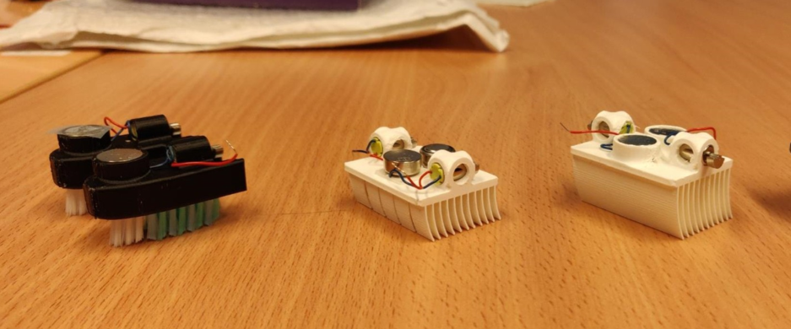
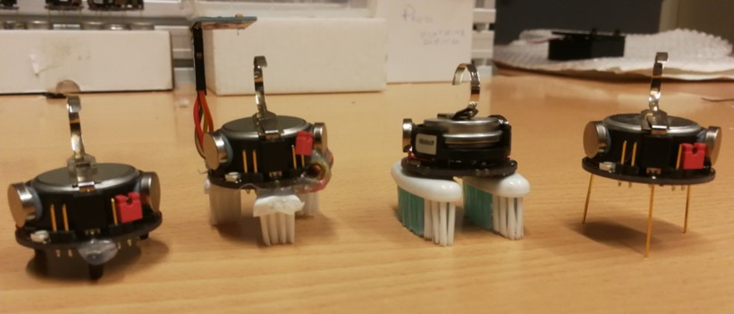
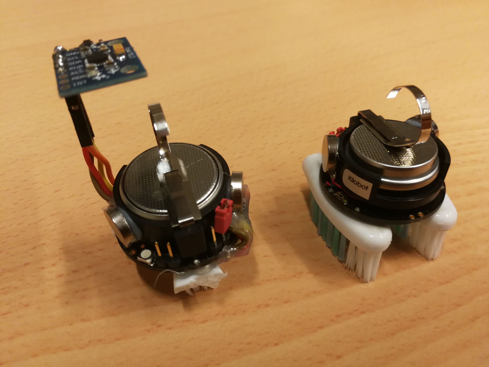

# Low-Cost Miniature Swarm Robot Design and Prototyping

This project presents the mechanical and electronic design of a **low-cost miniature swarm robot platform** developed during my master's internship (from **May 2019 to July 2019** ) at **Institute for Intelligent Systems and Robotics (ISIR), Sorbonne University**.

---

# Research Project Overview

Miniature robots are attractive for swarm robotics because they are inexpensive, lightweight, and scalable to large populations.

This research project aimed to explore the design of a **small and low-cost swarm robot platform** inspired by systems such as **Kilobot**, **Hexbug**, and other vibration-driven miniature robots.

This research project involved **mechanical design**, **electronics integration**, **sensor interfacing**, and **experimental prototyping**.

---

# Highlights

• Feasibility study of **wireless charging coils** for miniature robots  
• Design and prototyping of **multiple vibration-driven robot morphologies**  
• Development of a **small wheeled robot prototype** with stepper motors  
• Integration of **IMU sensors via I2C** for orientation sensing  
• Modification of **Kilobot morphology and electronics**  
• Implementation of a **closed-loop heading control strategy** for straight motion  

---

# Objectives

The project focused on the following key objectives:

- understanding vibration-based locomotion inspired by **Hexbug** and **Kilobot**
- operating and modifying existing Kilobot platforms
- integrating **inertial sensing units (IMU)** for motion control
- designing and prototyping new miniature robot concepts
- improving motion control through **embedded sensing and feedback**

---

# Part I Prototype Families

The target prototypes were intended to satisfy several constraints:

- miniature size (around 3 cm)
- at least two degrees of freedom
- short-range communication
- vibration-based locomotion
- possible wireless charging
- compatibility with low-cost embedded electronics

## Vibration-Driven Prototypes

Several vibration-driven prototypes were explored and compared.

These prototypes were 3D-designed and printed and uses ERM or LRA motors (shown in the following Figure).

---

## Small Wheeled Robot Prototype

In parallel, a small wheeled prototype was also designed and assembled.

Main features includ:

- two miniature stepper motors
- 3D-printed circular chassis
- custom wheels designed for rubber O-rings
- ATMega328p-based electronics
- A4988 motor drivers

This prototype was used to explore a more controllable locomotion alternative to purely vibration-driven motion.

---

## Kilobot Morphology Modifications

A standard Kilobot platform was used as a reference system and modified in several ways. Different morphologies variants were tested:

where from left to right:
- rubber-foot Kilobot
- two-toothbrush Kilobot
- three-toothbrush Kilobot
- original Kilobot as baseline

---

## Wireless Charging Feasibility Study

A feasibility study was carried out for **wireless charging** of miniature robots.

Several PCB coil geometries were designed and compared:

- spiral coils
- rectangular-spiral coils
- hexagonal-spiral coils

The goal was to evaluate their suitability for contactless charging of small robotic platforms.

---

# Part II IMU Integration and Closed-Loop Control

A **MPU6050** IMU (3-axis accelerometer + 3-axis gyroscope) was integrated to the modified Kilobot morphologies and was interfaced through **I2C** to communicate with the modified Kilobot morphologies.

An **IMU-based feedback loop** for heading control was implemented so that the robot could maintain a straighter trajectory from its initial heading.

The PID-based control strategy enabled:

- yaw estimation
- heading error computation
- correction of motor actuation
- partial straight-line motion stabilization

---

# Part III Experimental validation of the Closed-Loop heading Control

Experimental tests were performed to validate the proposed **Closed-Loop heading Control**.

**Without feedback control**

- the robot trajectory tended to curve

[Watch the demo video](video/Vidéo6_kilobot_brosse_a_dents_asservissement_1.mp4)

**With IMU-based correction**

- the robot was able to approximately maintain a straight direction from its initial heading

[Watch the demo video](video/Vidéo7_kilobot_brosse_a_dents_asservissement_2.mp4)

These results show that both **morphology design** and **embedded sensing** play an important role in the behavior of miniature robots.

---

# Technologies Used

## Sensors

- **MPU6050** IMU (3-axis accelerometer + 3-axis gyroscope)
- **Thermal MEMS** accelerometer for vibration-insensitive motion sensing
- preliminary investigation of **optical flow** and **laser sensors**

## Actuation

- ERM vibration motors
- LRA actuators
- miniature DC motors
- miniature stepper motors

## Embedded and Communication

- Arduino-based prototyping (ATMega328p, A4988 motor drivers, Arduino IDE)
- AVR / C programming
- I2C interfacing
- Kilobot PCB modifications

## Mechanical Design and Fabrication

- SolidWorks
- 3D printing

---

# Applications

Potential applications include:

- swarm robotics research & robotic morphology studies
- low-cost collective robotic systems
- miniature autonomous mobile robots

---

# Project Context

This internship was carried out within the framework of the project:

**MSR – Morphological and Swarm Robotics**

---

# References

[1] Z. Zhang,  
**Conception mécanique et électronique d’un robot de petite taille à bas prix**,  
Internship Report, Sorbonne University, 2019.

---

# Author

Zibo Zhang  
PhD in Robotics  
IMT Atlantique / Université Grenoble Alpes
