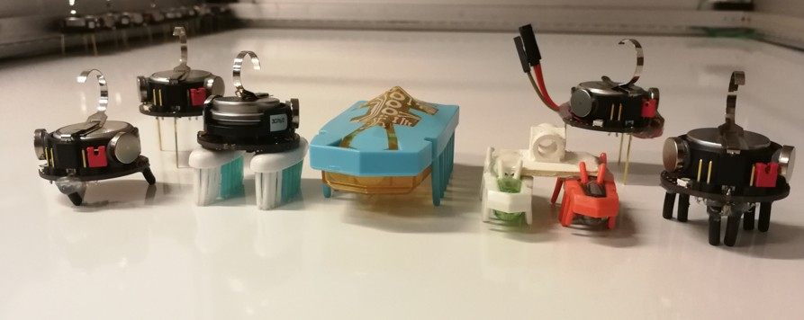

# Low-Cost Miniature Swarm Robot Design and Prototyping

This project presents the mechanical and electronic design of a **low-cost miniature swarm robot platform** developed during my master's internship (from **May 2019 to July 2019** ) at **Institute for Intelligent Systems and Robotics (ISIR), Sorbonne University**.

---

# Research Project Overview

Miniature robots are attractive for swarm robotics because they are inexpensive, lightweight, and scalable to large populations.

This research project aimed to explore the design of a **small and low-cost swarm robot platform** inspired by systems such as **Kilobot**, **Hexbug**, and other vibration-driven miniature robots.

This research project involved **mechanical design**, **electronics integration**, **sensor interfacing**, and **experimental prototyping**.

---

# Highlights

• Feasibility study of **wireless charging coils** for miniature robots  
• Design and prototyping of **multiple vibration-driven robot morphologies**  
• Development of a **small wheeled robot prototype** with stepper motors  
• Integration of **IMU sensors via I2C** for orientation sensing  
• Modification of **Kilobot morphology and electronics**  
• Implementation of a **closed-loop heading control strategy** for straight motion  

---

# Objectives

The project focused on the following key objectives:

- understanding vibration-based locomotion inspired by **Hexbug** and **Kilobot**
- operating and modifying existing Kilobot platforms
- integrating **inertial sensing units (IMU)** for motion control
- designing and prototyping new miniature robot concepts
- improving motion control through **embedded sensing and feedback**

---

# Prototype Families

The target prototypes were intended to satisfy several constraints:

- miniature size (around 3 cm)
- at least two degrees of freedom
- short-range communication
- vibration-based locomotion
- possible wireless charging
- compatibility with low-cost embedded electronics

These prototypes were designed to investigate the trade-off between: speed, directional stability, turning capability, and simplicity of fabrication

Two kinds of prototype was studied: **Vibration-Driven Prototypes** and **Small Wheeled Robot Prototype**

## Vibration-Driven Prototypes

Several vibration-driven robot prototypes were explored and compared, shown in the following Figure:

These tested prototypes included:

- brush-based locomotion
- small-fin locomotion
- long-fin locomotion
- modified Kilobot morphologies
- vibration actuation using ERM and LRA motors

---

## Small Wheeled Robot Prototype

In parallel, a small wheeled prototype was also designed and assembled.

Main features:

- two miniature stepper motors
- 3D-printed circular chassis
- custom wheels designed for rubber O-rings
- ATMega328p-based electronics
- A4988 motor drivers

This prototype was used to explore a more controllable locomotion alternative to purely vibration-driven motion.

---

# Hardware and Electronics

The project involved the study and integration of several miniature robotic components.

## Sensors

- **MPU6050** IMU (3-axis accelerometer + 3-axis gyroscope)
- **Thermal MEMS** accelerometer for vibration-insensitive motion sensing
- preliminary investigation of **optical flow** and **laser sensors**

## Actuation

- ERM vibration motors
- LRA actuators
- miniature DC motors
- miniature stepper motors

## Embedded and Communication

- Arduino-based prototyping
- AVR / C programming
- I2C interfacing
- Kilobot PCB modifications

---

# Wireless Charging Feasibility Study

A feasibility study was carried out for **wireless charging** of miniature robots.

Several PCB coil geometries were designed and compared:

- spiral coils
- rectangular-spiral coils
- hexagonal-spiral coils

The goal was to evaluate their suitability for contactless charging of small robotic platforms.

---

# Kilobot Modifications

A standard Kilobot platform was used as a reference system and modified in several ways.

## Morphology Variants

Different support morphologies were tested:

- rubber-foot Kilobot
- two-toothbrush Kilobot
- three-toothbrush Kilobot
- original Kilobot as baseline

These modifications were used to evaluate the effect of morphology on:

- speed
- straightness of motion
- noise
- directional bias

---

# IMU Integration and Closed-Loop Control

An important part of the internship was to integrate an **IMU-based feedback loop** for heading control.

The MPU6050 was interfaced through **I2C**, and a control strategy was proposed so that the robot could maintain a straighter trajectory from its initial heading.

The control architecture enabled:

- yaw estimation
- heading error computation
- correction of motor actuation
- partial straight-line motion stabilization

Illustration of the control principle:

---

# Experimental Findings

The experiments highlighted several useful observations.

## Vibration-Driven Motion

Among the tested vibration-based morphologies:

- the **three-toothbrush** version was the fastest, but followed a more circular trajectory
- the **two-toothbrush** version was slightly slower, but exhibited a nearly linear trajectory
- the **rubber-foot** version was slower and noisier

## Closed-Loop Orientation Control

Without feedback control:

- the robot trajectory tended to curve

With IMU-based correction:

- the robot was able to approximately maintain a straight direction from its initial heading

These results show that both **morphology design** and **embedded sensing** play an important role in the behavior of miniature robots.

---

# Technologies Used

## Programming

- C
- AVR programming
- Arduino IDE

## Embedded Systems

- ATMega328p
- A4988 motor drivers
- I2C communication

## Sensors

- MPU6050
- Thermal MEMS accelerometer

## Mechanical Design and Fabrication

- SolidWorks
- 3D printing
- rapid prototyping
- wheel and chassis design

## Actuation

- ERM vibration motors
- LRA actuators
- stepper motors
- miniature DC motors

---

# Applications

Potential applications include:

- swarm robotics research
- low-cost collective robotic systems
- miniature autonomous mobile robots
- embedded locomotion experiments
- robotic morphology studies
- educational and research robot platforms

---

# Project Context

This internship was carried out at:

**Institute for Intelligent Systems and Robotics (ISIR)**  
Sorbonne University  
Paris, France

within the framework of the project:

**MSR – Morphological and Swarm Robotics**

---

# References

[1] Z. Zhang,  
**Conception mécanique et électronique d’un robot de petite taille à bas prix**,  
Internship Report, Sorbonne University, 2019.

[2] Z. Zhang,  
Internship presentation slides and weekly reports,  
ISIR / Sorbonne University, 2019.

---

# Author

Zibo Zhang  
PhD in Robotics  
IMT Atlantique / Université Grenoble Alpes
